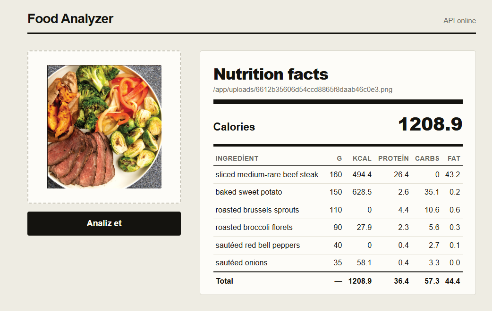
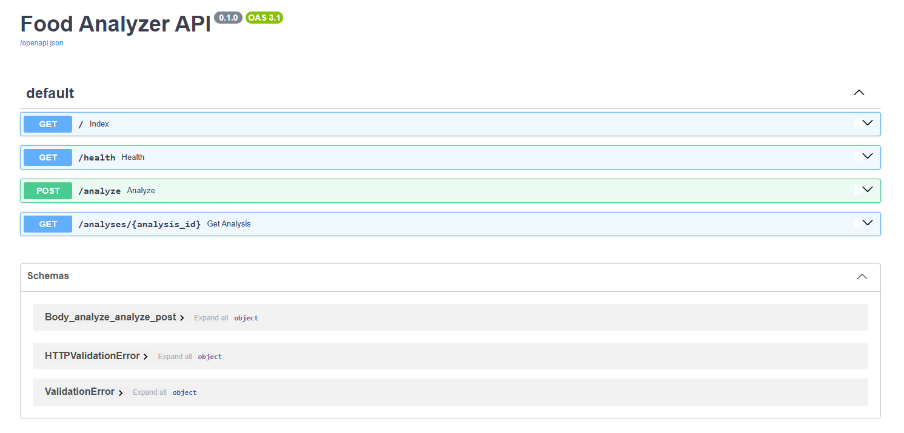

# Food Analyzer

> Upload a meal photo → AI identifies ingredients with portion sizes → USDA nutrition lookup → calories and macronutrient totals.

**Team:** Team #1
**Topic:** 2 — AI Food Analyzer
**Course:** AI-ENG-110 Software Engineering, AI Academy
**Repository:** https://github.com/Gunas12/Food_Analyzer

---

## Live demo

🔗 **[https://food-analyzer-tx9l.onrender.com/](https://food-analyzer-tx9l.onrender.com/)** — web UI, deployed on [Render](https://render.com/) 

- Web UI: https://food-analyzer-tx9l.onrender.com/
- Interactive API docs (Swagger UI): https://food-analyzer-tx9l.onrender.com/docs
- Health check: https://food-analyzer-tx9l.onrender.com/health

> Render's free tier spins the service down after inactivity — the first request after a while can take 30–60s to wake it up.

| Web UI                                                                                                                                     | Interactive API docs (`/docs`)                                                                                                        |
| ------------------------------------------------------------------------------------------------------------------------------------------ | ------------------------------------------------------------------------------------------------------------------------------------- |
|  |  |

---

## Quick start

### 1. Clone and install

```bash
git clone https://github.com/Gunas12/Food_Analyzer.git
cd Food_Analyzer

python -m venv .venv
.venv\Scripts\activate          # Windows
# source .venv/bin/activate     # macOS / Linux

pip install -r requirements.txt
```

### 2. Configure environment

```bash
cp .env.example .env
```

Edit `.env` and fill in your API keys:

```env
LLM_PROVIDER=gemini
LLM_MODEL=gemini-2.0-flash
GOOGLE_API_KEY=<your-google-api-key>

NUTRITION_PROVIDER=usda
USDA_API_KEY=<your-usda-api-key>

POSTGRES_USER=postgres
POSTGRES_PASSWORD=dev
POSTGRES_DB=foodanalyzer
POSTGRES_HOST=localhost
POSTGRES_PORT=5432
```

> Get a free USDA key at https://fdc.nal.usda.gov/api-key-signup
> **Never commit `.env`** — it is in `.gitignore`.

### 3. Start everything with Docker

```bash
docker compose up --build     # starts PostgreSQL + the API together
```

Open **http://localhost:8000** — the web UI loads automatically.

### 4. Try the CLI (offline, no API keys needed)

```bash
python data/_make_samples.py    # one-time: generate sample PNG images

# Windows
$env:PYTHONPATH="."
python -m src.cli analyze data/rice_chicken_broccoli.png

# macOS / Linux
PYTHONPATH=. python -m src.cli analyze data/rice_chicken_broccoli.png
```

---

## API usage

FastAPI auto-generates interactive docs at **`/docs`** (Swagger UI) and `/openapi.json` —
locally that's http://localhost:8000/docs, or try the deployed version at
https://food-analyzer-tx9l.onrender.com/docs.

### Health check

```bash
curl http://localhost:8000/health
# {"status":"ok"}
```

### Analyze a meal photo

```bash
curl -X POST http://localhost:8000/analyze -F "file=@data/rice_chicken_broccoli.png"
```

Response:

```json
{
  "id": 6,
  "created_at": "2026-09-18T09:47:52.747432Z",
  "image_path": "/app/uploads/8328acf4af0144c1aa8e3b0f650b7ca9.png",
  "meal_recognized": true,
  "ingredients": [
    {
      "name": "grilled beef patty",
      "estimated_grams": 150.0,
      "confidence": 0.8,
      "kcal": 1860.0,
      "protein_g": 34.5,
      "carbs_g": 0.0,
      "fat_g": 32.7
    },
    {
      "name": "white rice",
      "estimated_grams": 120.0,
      "confidence": 0.85,
      "kcal": 430.8,
      "protein_g": 8.328,
      "carbs_g": 95.76,
      "fat_g": 1.56
    }
  ],
  "totals": {
    "kcal": 2290.8,
    "protein_g": 42.828,
    "carbs_g": 95.76,
    "fat_g": 34.26
  }
}
```

### Fetch a past analysis

```bash
curl http://localhost:8000/analyses/1
```

```json
{
  "id": 1,
  "created_at": "2026-09-15T11:10:02.563577Z",
  "image_path": "/app/uploads/8cfee6f29d3c44bb89de0d9049e92156.png",
  "meal_recognized": true,
  "ingredients": [
    {
      "name": "beef patty",
      "estimated_grams": 110.0,
      "confidence": 0.75,
      "kcal": 1364.0,
      "protein_g": 25.3,
      "carbs_g": 0.0,
      "fat_g": 23.98
    },
    {
      "name": "hard-boiled egg",
      "estimated_grams": 50.0,
      "confidence": 0.85,
      "kcal": 77.5,
      "protein_g": 6.3,
      "carbs_g": 0.56,
      "fat_g": 5.3
    }
  ],
  "totals": {
    "kcal": 1441.5,
    "protein_g": 31.6,
    "carbs_g": 0.56,
    "fat_g": 29.28
  }
}
```

404 is returned for an unknown id.

---

## Run tests

```bash
$env:PYTHONPATH="."             # Windows
# PYTHONPATH=.                  # macOS / Linux

pytest                                           # all 143 tests
pytest --cov=src --cov-report=term-missing       # with coverage
pytest tests/test_ai_smoke.py -v                 # smoke tests only
```

All tests run **offline** — no API keys or network required.

**Latest results:** 143/143 passing · `src/` coverage **97%** · `mypy src/` 0 errors.

---

## Docker

### Build and run the full application image

```bash
docker compose up --build
```

Brings up PostgreSQL (`foodanalyzer-db`) and the API together — no separate
image-build step needed. Open http://localhost:8000.

```bash
docker compose down       # stop, keep data
docker compose down -v    # stop and delete data
```

---

## Project layout

```
Food_Analyzer/
├── ai/                          # provided AI module — do not edit
│   ├── providers/                 # Anthropic, OpenAI, Gemini adapters
│   ├── vlm.py                     # identify_ingredients()
│   ├── nutrition.py                # NutritionProvider / USDAProvider
│   ├── calculator.py               # compute_totals()
│   └── schemas.py                  # Ingredient, NutritionFacts
│
├── src/                          # SE layer (our work)
│   ├── config.py                   # pydantic-settings typed config
│   ├── models.py                   # IngredientLine, MealTotals, AnalysisRecord
│   ├── validation.py                # image format + size checks
│   ├── wiring.py                    # composition root
│   ├── cli.py                       # python -m src.cli analyze <path>
│   ├── api.py                       # FastAPI: POST /analyze, GET /analyses/{id}
│   ├── core/analyzer.py             # main pipeline (validate → VLM → nutrition → totals)
│   ├── services/                    # AIService (retry), NutritionCache (TTL)
│   ├── concurrency/                 # NutritionPipeline (asyncio.gather + Semaphore)
│   └── storage/repository.py        # SQLAlchemy async repository → PostgreSQL
│
├── tests/                        # 143 tests, all offline
├── data/                          # sample meal images
├── static/index.html              # browser demo UI
├── scripts/bench.py                # sequential vs concurrent benchmark
├── docker-compose.yml              # PostgreSQL + API
├── Dockerfile
├── requirements.txt
├── .env.example
└── TOPIC.md
```

---

## Architecture

```
Browser / curl
      │
      ▼
FastAPI  api.py
  ├── POST /analyze
  │     ├── validation (MIME + size check, UUID filename)
  │     ├── AIService.identify_ingredients()   ← retry, exponential backoff
  │     │       └── ai.vlm.identify_ingredients()   ← Gemini / Anthropic / OpenAI
  │     ├── NutritionPipeline.lookup()          ← asyncio.gather + Semaphore(10)
  │     │       ├── NutritionCache (TTL 24h)
  │     │       └── ai.nutrition.USDAProvider.lookup()
  │     ├── ai.calculator.compute_totals()
  │     └── repository.save()                    ← PostgreSQL
  │
  └── GET /analyses/{id}  → repository.get() → PostgreSQL
```

Full diagram and design rationale: [`docs/architecture.md`](docs/architecture.md).

---

## Sequential vs concurrent benchmark

| Workload                                            | N (ingredients) | Sequential | Concurrent (semaphore=10) | Speedup  |
| --------------------------------------------------- | --------------- | ---------- | ------------------------- | -------- |
| Nutrition lookup, simulated 150 ms latency per call | 10              | 1.518 s    | 0.153 s                   | **9.9×** |

**Reproduce:**

```bash
python scripts/bench.py     # set PYTHONPATH=. first if running outside Docker
```

---

## Environment variables

| Variable                      | Default        | Purpose                                                      |
| ----------------------------- | -------------- | ------------------------------------------------------------ |
| `LLM_PROVIDER`                | `gemini`       | VLM provider (`anthropic` / `openai` / `gemini`)             |
| `LLM_MODEL`                   | —              | Model ID (e.g. `gemini-2.0-flash`)                           |
| `ANTHROPIC_API_KEY`           | —              | Required when `LLM_PROVIDER=anthropic`                       |
| `OPENAI_API_KEY`              | —              | Required when `LLM_PROVIDER=openai`                          |
| `GOOGLE_API_KEY`              | —              | Required when `LLM_PROVIDER=gemini`                          |
| `USDA_API_KEY`                | —              | [Free USDA key](https://fdc.nal.usda.gov/api-key-signup)     |
| `POSTGRES_HOST`               | `localhost`    | PostgreSQL host                                              |
| `POSTGRES_PORT`               | `5432`         | PostgreSQL port                                              |
| `POSTGRES_DB`                 | `foodanalyzer` | Database name                                                |
| `POSTGRES_USER`               | `postgres`     | Database user                                                |
| `POSTGRES_PASSWORD`           | `dev`          | Database password                                            |
| `NUTRITION_CACHE_TTL_SECONDS` | `86400`        | Cache TTL (24h)                                              |
| `MAX_IMAGE_SIZE_MB`           | `5`            | Upload size limit                                            |
| `MAX_PARALLEL`                | `10`           | Semaphore bound for nutrition lookups                        |
| `HTTP_PORT`                   | `8000`         | API port                                                     |
| `LOG_LEVEL`                   | `INFO`         | Read into `Settings`; not yet wired to `logging.basicConfig` |

Full list and defaults: `.env.example`.

---

## SE layer — what we built

| Requirement      | Implementation                                                               |
| ---------------- | ---------------------------------------------------------------------------- |
| Typed config     | `pydantic-settings` `Settings` class, `get_settings()` cached                |
| Image validation | Magic-byte check (JPEG/PNG), size limit, UUID-based filenames                |
| Logging          | `logging` module, `logger.info`/`logger.warning` at key steps                |
| Retries          | `AIService` — 3 attempts, exponential backoff on `ProviderError`             |
| Cache            | In-memory TTL cache (`NutritionCache`), default 24h                          |
| Concurrency      | `asyncio.gather` + `Semaphore(MAX_PARALLEL)` — N ingredients in ~1 call time |
| Storage          | SQLAlchemy async engine, `analysis_records` table (JSON columns)             |
| HTTP API         | FastAPI `POST /analyze`, `GET /analyses/{id}`, `GET /health`                 |
| CLI              | `python -m src.cli analyze <path>`, exit code 2 on validation error          |
| Tests            | 143 tests across 12 files, all offline, `pytest-asyncio`                     |
| Docker           | multi-stage `python:3.12-slim`, non-root user, `uvicorn` CMD                 |
| Demo UI          | Single-page HTML at `GET /` — drag-and-drop upload, results table            |

---

## Git workflow

- `main` is protected — all changes via Pull Request
- Branch naming: `user<N>/short-description` (e.g. `user2/storage-repository`)
- Every PR requires ≥1 teammate review
- Final release tag: `v1.0-final`

---

## Team

**Project:** AI Food Analyzer | **Group:** Team #1

| #   | Member           | GitHub                                               | Focus                                                   |
| --- | ---------------- | ---------------------------------------------------- | ------------------------------------------------------- |
| 1   | Gunash Mammadova | [@Gunas12](https://github.com/Gunas12)               | Config, models, wiring, CLI, Docker, final integration  |
| 2   | Punhan Murselov  | [@Punhan0](https://github.com/Punhan0)               | Storage (repository, PostgreSQL)                        |
| 3   | Ali Muradov      | [@Ali-Muradov](https://github.com/Ali-Muradov)       | AIService (retry), NutritionCache, concurrency pipeline |
| 4   | Esmira Mammadli  | [@EsmiraMammadli](https://github.com/EsmiraMammadli) | FastAPI endpoints, static demo UI                       |

Per-member file/PR ownership: [`report/CONTRIBUTION_STATEMENT.md`](report/CONTRIBUTION_STATEMENT.md).
AI tool disclosure: `report/report.pdf` §10 and [`report/CONTRIBUTION_STATEMENT.md`](report/CONTRIBUTION_STATEMENT.md).
