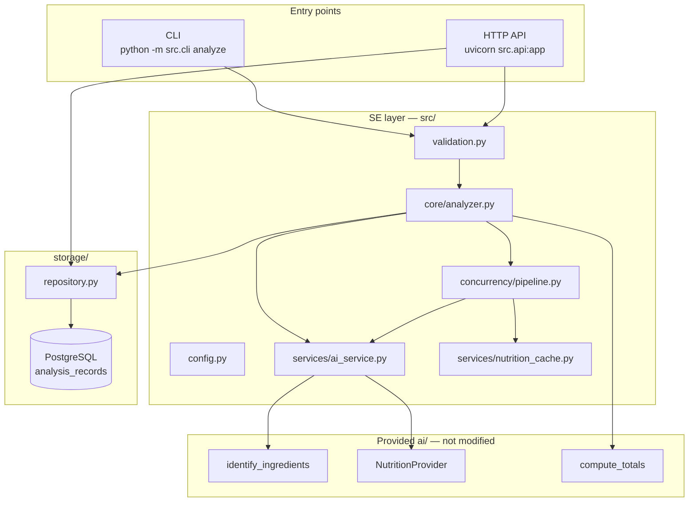

# Architecture

High-level view of the **SE layer** (`src/`) around the provided `ai/` module.

## Request flow

### Analyze path (CLI or HTTP)

1. **Validate** image — path (`validate_image_path`, CLI) or upload bytes
   (`_validate_and_save_image`, HTTP). JPEG/PNG only, magic-byte checked,
   size capped by `MAX_IMAGE_SIZE_MB`.
2. **Identify** ingredients via VLM, through `AIService.identify_ingredients()`
   (3 attempts, exponential backoff on `ProviderError`).
3. **Look up** nutrition for every ingredient in parallel — `NutritionPipeline`
   (`asyncio.gather` + `Semaphore(MAX_PARALLEL)`), backed by `NutritionCache`
   (TTL, default 24h) and the same `AIService` retry policy.
4. **Compute** meal totals (`ai.calculator.compute_totals`) and build an
   `AnalysisRecord`.
5. **Persist** — `Repository.save()` writes the record to PostgreSQL.

The CLI runs this through `core.analyzer.FoodAnalyzer.analyze()`. The HTTP API
performs the same five steps inline inside `create_app()` in `api.py` rather
than calling `FoodAnalyzer` — both paths mirror each other step-for-step, but
today the logic exists in two places instead of one. Worth naming as a known
duplication in the report rather than leaving it implicit.

## Module map

| Path | Role |
|---|---|
| `config.py` | Typed settings from env (`pydantic-settings`) |
| `models.py` | `IngredientLine`, `MealTotals`, `AnalysisResult`, `AnalysisRecord` |
| `validation.py` | Image format/size checks for the CLI; `ValidationError` |
| `wiring.py` | Composition root — builds `Repository` + `AIService` + `NutritionPipeline` from `Settings` |
| `core/analyzer.py` | `FoodAnalyzer` — validate → identify → parallel nutrition → totals → save |
| `api.py` | FastAPI app: `GET /health`, `POST /analyze`, `GET /analyses/{id}`, `GET /` |
| `cli.py` | `python -m src.cli analyze <path>`, table output, exit code 2 on validation error |
| `services/ai_service.py` | Retry wrapper (3 attempts, exponential backoff) around `ai.*` calls |
| `services/nutrition_cache.py` | In-memory TTL cache for nutrition lookups |
| `concurrency/pipeline.py` | `NutritionPipeline` — bounded parallel lookups, cache-aware |
| `storage/repository.py` | SQLAlchemy async `Repository` — `save()`, `get()`, `list_recent()` |

## Component status

| Component | Status | Notes |
|---|---|---|
| Typed config | done | `Settings`, `.env` |
| CLI `analyze` | done | Exit code 2 on `ValidationError` |
| HTTP API | done | `POST /analyze`, `GET /analyses/{id}`, `GET /health` — see [api.md](./api.md) |
| PostgreSQL repository | done | See [storage.md](./storage.md) |
| Nutrition cache + TTL | done | Wired into `NutritionPipeline` |
| Parallel nutrition lookups | done | `asyncio.gather` + `Semaphore(MAX_PARALLEL)` |
| Retries / backoff | done | `AIService`, shared by identification and nutrition lookups |
| Per-call timeout | **not implemented** | Retries are bounded, but no timeout caps a single call; only the provided USDA client has its own internal 10s timeout. Named as a known gap for the report's Robustness section. |
| `GET /analyses` (list) | **not implemented** | `Repository.list_recent()` exists and is tested, but no route calls it yet |
| Docker | done | `docker compose up --build` — API + PostgreSQL |

## Error handling

| Exception | HTTP status | CLI exit code | When |
|---|---|---|---|
| `ValidationError` | 400 | 2 | Bad format, oversize, empty upload |
| `ProviderError` (exhausted retries) | 503 | — (propagates) | VLM or nutrition provider unavailable |

An unrecognized meal (`meal_recognized: false`) is not an error in either
path — it is a normal `AnalysisRecord` with empty ingredients and zeroed
totals.

## Testing

- **Offline:** the AI module and HTTP layer are mocked/faked in every test —
  see `tests/test_analyzer.py`, `tests/test_api.py`, `tests/test_ai_service.py`.
- **Storage tests:** run against `sqlite+aiosqlite:///:memory:`, not a live
  PostgreSQL instance — see [storage.md](./storage.md).
- **Concurrency tests:** `tests/test_pipeline.py` verifies the semaphore
  bound and that one failed lookup doesn't sink the batch.
- **Smoke:** `tests/test_ai_smoke.py` — provided by the course, not modified.

143/143 tests passing, 97% coverage on `src/` (see README for the breakdown).

## Related docs

- [HTTP API](./api.md) — endpoints, curl, run instructions
- [Storage](./storage.md) — schema, repository interface
- [TOPIC.md](../TOPIC.md) — full course requirements
